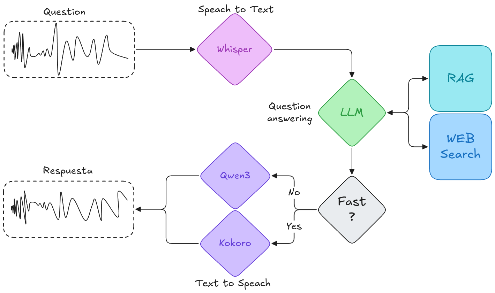

# General Python Project Template

[English](#english) | [Español](#español)

---

<a name="english"></a>
## English

This repository contains the source code that allows a voice asistan to receive voice questions, process them, look for the proper information locally or web, and then answer via voice again. 

This is the structure that this system follows:



### Setup & Installation
Run the following commands to create your local environment and install dependencies:

```bash
python3.12 -m venv venv
source venv/bin/activate

# Install the app module in editable mode
pip install -e app/

# Install requirements using uv for speed
pip install uv
uv pip install -r requirements.txt

# Setup Jupyter Kernel
pip install ipykernel
python -m ipykernel install --user --name=venv --display-name "Python (venv)"
```

## RAG Web Results

To use the Tavily web information retrieval service, you must add your TAVILY_API_KEY to the .env file. Without this environment variable set, the service will not be able to authenticate or function correctly.

```bash
TAVILY_API_KEY="YOUR_API_KEY"
```

## TTS Models

This project supports multiple Text-to-Speech models:

#### Qwen3-TTS

[Qwen3-TTS](https://huggingface.co/Qwen/Qwen3-TTS-12Hz-1.7B-CustomVoice) is a powerful multilingual TTS model supporting 10 languages (Chinese, English, Japanese, Korean, German, French, Russian, Portuguese, Spanish, and Italian).

**Additional System Dependencies:**
```bash
# Install SoX (required for audio processing)
sudo apt install sox -y
```

**Python Dependencies:**
```bash
# Install qwen-tts package (requires transformers==4.57.3)
pip install qwen-tts

# Ensure correct transformers version
pip install transformers==4.57.3

# Optional: Install flash-attn for faster inference
pip install flash-attn --no-build-isolation
```

### Usage
```bash
cd app

# No ui
python main.py full -a path/to/audio.xxx

# Web ui
streamlit run app.py
```

**Available Speakers:**
| Speaker | Description | Native Language |
|---------|-------------|-----------------|
| Vivian | Bright, slightly edgy young female voice | Chinese |
| Serena | Warm, gentle young female voice | Chinese |
| Uncle_Fu | Seasoned male voice with low, mellow timbre | Chinese |
| Dylan | Youthful Beijing male voice | Chinese (Beijing) |
| Eric | Lively Chengdu male voice | Chinese (Sichuan) |
| Ryan | Dynamic male voice with strong rhythm | English |
| Aiden | Sunny American male voice | English |
| Ono_Anna | Playful Japanese female voice | Japanese |
| Sohee | Warm Korean female voice | Korean |

*Maintained by [MiquelGomezCorral](https://miquelgc.net)*

<a name="español"></a>
## Español

Este repositorio contiene el código fuente que permite a un asistente de voz recibir preguntas de voz, procesarlas, buscar la información adecuada localmente o en la web y, a continuación, responder de nuevo por voz.

Esta es la estructura que sigue este sistema:


### Configuración e Instalación
Ejecuta los siguientes comandos para crear tu entorno local e instalar las dependencias:

```bash
python3.12 -m venv venv
source venv/bin/activate

# Instalar el módulo app en modo editable
pip install -e app/

# Instalar requisitos usando uv para mayor velocidad
pip install uv
uv pip install -r requirements.txt

# Configurar el Kernel de Jupyter
pip install ipykernel
python -m ipykernel install --user --name=venv --display-name "Python (venv)"
```
### Aplicación Web
Para ejecutar la interfaz web interactiva (Streamlit):

```bash
cd app
streamlit run app.py
```

## Resultados Web RAG

Para utilizar el servicio de obtención de información web de Tavily, debes añadir tu TAVILY_API_KEY en el archivo .env. Si esta variable de entorno no está configurada, el servicio no podrá autenticarse ni funcionar correctamente.

```bash
TAVILY_API_KEY="YOUR_API_KEY"
```

## Modelos TTS

Este proyecto soporta múltiples modelos de Text-to-Speech:

#### Qwen3-TTS

[Qwen3-TTS](https://huggingface.co/Qwen/Qwen3-TTS-12Hz-1.7B-CustomVoice) es un potente modelo TTS multilingüe que soporta 10 idiomas (Chino, Inglés, Japonés, Coreano, Alemán, Francés, Ruso, Portugués, Español e Italiano).

**Dependencias del Sistema Adicionales:**
```bash
# Instalar SoX (requerido para procesamiento de audio)
sudo apt install sox -y
```

**Dependencias de Python:**
```bash
# Instalar el paquete qwen-tts (requiere transformers==4.57.3)
pip install qwen-tts

# Asegurar la versión correcta de transformers
pip install transformers==4.57.3

# Opcional: Instalar flash-attn para inferencia más rápida
pip install flash-attn --no-build-isolation
```

### Usage
```bash
cd app

# No ui
python main.py full -a path/to/audio.xxx

# Web ui
streamlit run app.py
```

**Voces Disponibles:**
| Voz | Descripción | Idioma Nativo |
|-----|-------------|---------------|
| Vivian | Voz femenina joven brillante | Chino |
| Serena | Voz femenina joven cálida y suave | Chino |
| Uncle_Fu | Voz masculina madura con timbre grave | Chino |
| Dylan | Voz masculina juvenil de Beijing | Chino (Beijing) |
| Eric | Voz masculina animada de Chengdu | Chino (Sichuan) |
| Ryan | Voz masculina dinámica con ritmo fuerte | Inglés |
| Aiden | Voz masculina americana soleada | Inglés |
| Ono_Anna | Voz femenina japonesa juguetona | Japonés |
| Sohee | Voz femenina coreana cálida | Coreano |

*Matenido por [MiquelGomezCorral](https://miquelgc.net)*
